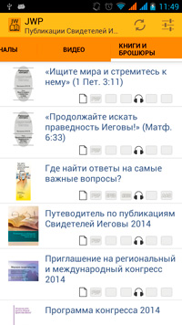
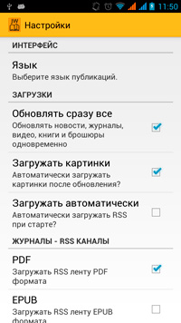

JWP
===
JWP - это программа для читателей публикаций Свидетелей Иеговы.

Используя эту программу, вы всегда будете иметь доступ к актуальным выпускам журналов "Сторожевая башня" и "Пробудитесь".
Вы сможете загрузить публикации на разных языках и в различных форматах (PDF, EPUB, MOBI, MP3, AAC). А также смотреть последние новости с сайта www.jw.org.
Программа работает как RSS клиент.
Также вы можете включить функцию скачивания видео материалов, книг и брошюр.

Напоминание: используя мобильный интернет - помните о трафике.

